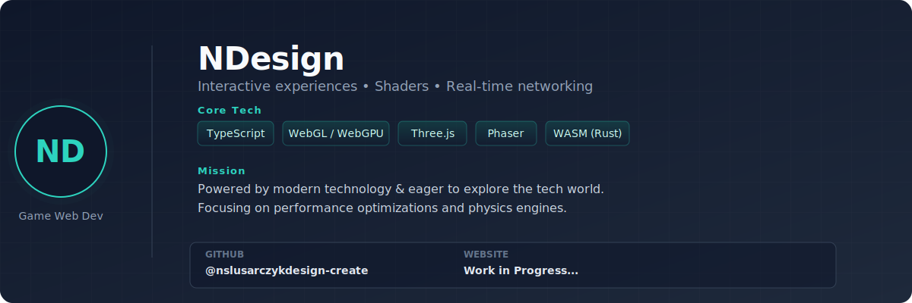

# Game Web Developer — Profile Card

Game Web Developer powered by modern technology, eager to explore the tech world.

Hi! I'm a Game Web Developer focused on building rich, performant browser and multiplayer experiences with modern web tech. I craft interactive experiences with WebGL / WebGPU, real-time networking, and shader-driven visuals, using TypeScript-first stacks and WebAssembly where it makes sense.

Core highlights
- Role: Game Web Developer
- Motto: Powered by modern technology · Eager to explore the tech world
- Tech I use: TypeScript · WebGL / WebGPU · Three.js · Babylon.js · Phaser · React / Next.js · Node.js · Deno · WebAssembly (Rust) · GLSL · Shaders · Physics & Networking
- Focus: interactive experiences, performance, cross-platform web games, tooling & pipelines
